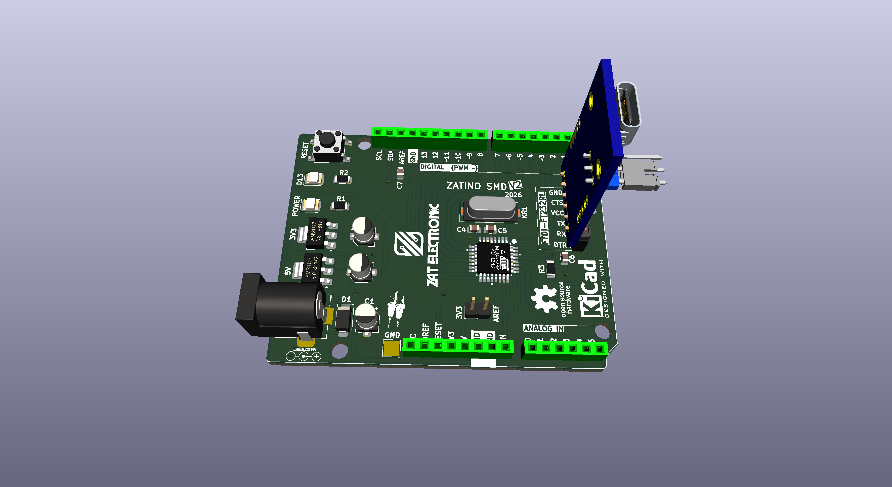
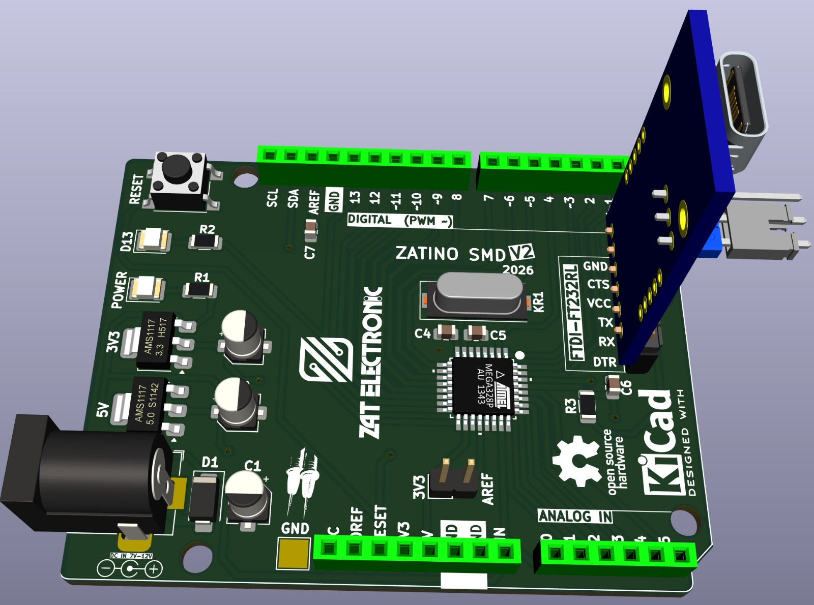

  

  

# Olá 👋, eu sou Kenneth Zat

⚡ **Engenheiro Eletrônico & Desenvolvedor de Firmware**  
🇧🇷 Brasil · Osasco, SP

Projeto **placas de circuito impresso** e desenvolvo o **firmware** que roda nelas.  
Apaixonado por transformar ideias em hardware real — do esquemático ao produto final.

---

## 🌐 Onde me encontrar

  
  
  

  
  

---

## 🧠 O que eu faço

- ⚡ Projeto de PCB — do esquemático ao layout final
- 🔌 Desenvolvimento de firmware para as placas que projeto
- ⚙️ Integração completa entre hardware e software embarcado
- 🛠️ Prototipagem e testes com Arduino, ESP32, STM32 e Raspberry Pi

---

## 🎓 Formação

| Título | Área |
|---|---|
| 🎓 Engenheiro Eletrônico | Engenharia Eletrônica |

---

## 🛠️ Tecnologias & Ferramentas

### ⚡ Design de Hardware

### 🖥️ IDEs & Ambientes de Desenvolvimento

### 💻 Plataformas & Hardware

### 📝 Linguagens de Programação

### 🛠️ Ferramentas Gerais & Sistemas Operacionais

---

## 📦 Projetos em Destaque

| Projeto | Descrição | Stack |
|---|---|---|
| [**ZATINO V2 SMD**](https://github.com/zatelectronic/ZATINO_SMD_V2) | Arduino StandAlone SMD | Arduino, C++ |
| [**Projeto 2**](https://github.com/zatelectronic/REPO-2) | Descrição do projeto 2 | — |
| [**Projeto 3**](https://github.com/zatelectronic/REPO-3) | Descrição do projeto 3 | — |
| [**Projeto 4**](https://github.com/zatelectronic/REPO-4) | Descrição do projeto 4 | — |
| [**Projeto 5**](https://github.com/zatelectronic/REPO-5) | Descrição do projeto 5 | — |

---

## 🖨️ Minhas PCBs

  
  
  
  

---

## 📊 Atividade

  
  
  
  

  

  
  

---

## 🚀 Filosofia

> _"Não basta projetar o hardware.  
> Precisa dar vida a ele.  
> Do esquemático ao firmware — esse é o caminho."_

---

⭐ Se curtiu algum projeto, deixa uma estrela  
🤝 Aberto a colaborações em projetos de hardware, PCB e firmware